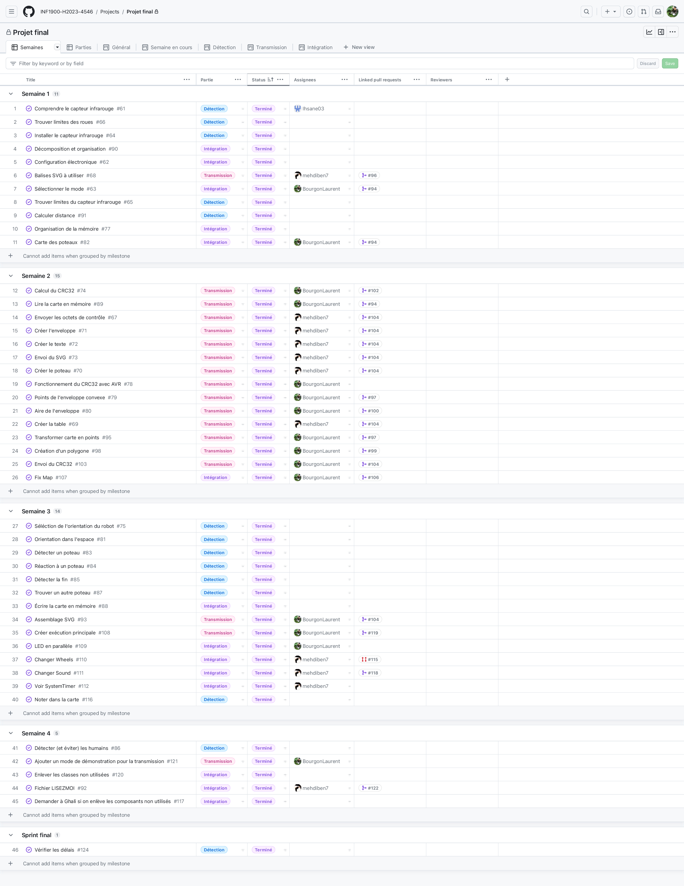

# Projet 1

*Hiver 2023 - 4546*

- Catalina Andrea Araya Figueroa
- Mehdi Benouhoud
- Laurent Bourgon
- Ihsane Majdoubi

## TP

Pour apprendre à utiliser le robot, neuf travaux pratiques ont été réalisés.

Les six premiers travaux pratiques ont été faits en équipe de deux. Les trois derniers ont été faits en équipe de quatre.

| n°  | #1                             | #2              |
| --- | ------------------------------ | --------------- |
| 45  | Mehdi Benouhoud                | Laurent Bourgon |
| 46  | Catalina Andrea Araya Figueroa | Ihsane Majdoubi |

Voici les travaux pratiques réalisés en équipe de deux :

| n°  | Nom                                         | [45](equipe-45/)                                                                                              | [46](equipe-46/)                                                                                              |
| --- | ------------------------------------------- | ------------------------------------------------------------------------------------------------------------- | ------------------------------------------------------------------------------------------------------------- |
| 1   | Introduction à la carte mère                | [51d5f84](https://github.com/INF1900-H2023-4546/Projet1/tree/51d5f84118076cc0b46dafb8c6e163fb710c42c3/tp/tp1) |                                                                                                               |
| 2   | Machine à états finis                       | [31e48eb](https://github.com/INF1900-H2023-4546/Projet1/tree/31e48eb786f4bfefce4d4f053e60489195f43d58/tp/tp2) | [b7f73fd](https://github.com/INF1900-H2023-4546/Projet1/tree/b7f73fdc75685b165a35546586468f8871a35536/tp/tp2) |
| 3   | PWM logiciel                                | [97880ba](https://github.com/INF1900-H2023-4546/Projet1/tree/97880ba2a32b073b86ac42f8682fe5a2cf867420/tp/tp3) | [945735f](https://github.com/INF1900-H2023-4546/Projet1/tree/945735f66f5f380e051b0b855dedae51d00d4bd7/tp/tp3) |
| 4   | Scrutation et interruptions                 | [48aeea2](https://github.com/INF1900-H2023-4546/Projet1/tree/48aeea2cea919e12fa0e1e26091c947c16525d36/tp/tp4) | [945735f](https://github.com/INF1900-H2023-4546/Projet1/tree/945735f66f5f380e051b0b855dedae51d00d4bd7/tp/tp4) |
| 5   | Communication RS232 et EEPROM               | [1e9e15b](https://github.com/INF1900-H2023-4546/Projet1/tree/1e9e15b950497a17c3860f74aefe50a4b7ea91e1/tp/tp5) | [945735f](https://github.com/INF1900-H2023-4546/Projet1/tree/945735f66f5f380e051b0b855dedae51d00d4bd7/tp/tp5) |
| 6   | Conversion analogique/numérique et capteurs | [615d508](https://github.com/INF1900-H2023-4546/Projet1/tree/615d508bd8f7e8bdc42a37b1e57b81db50c3d67f/tp/tp6) | [30fd4cc](https://github.com/INF1900-H2023-4546/Projet1/tree/30fd4cccd459bad632682683ce05ace20ca16e22/tp/tp6) |

Voici les travaux pratiques réalisés en équipe de quatre :

| n°     | Nom                       | [4546](tp/)                                                                                                   |
| ------ | ------------------------- | ------------------------------------------------------------------------------------------------------------- |
| 7 (+8) | Librairie & Débogage      | [762c7ff](https://github.com/INF1900-H2023-4546/Projet1/tree/762c7ff218a5e9e018a8d5f2dc482fef744277de/tp/tp7) |
| 9      | Trajectoire préprogrammée | [24a6066](https://github.com/INF1900-H2023-4546/Projet1/tree/24a6066fe280e4ba908169a9d9fe1a2539371a20/tp/tp9) |

## Projet

Le README du projet est disponible [ici](projet/README.md).

## Méthodologie

### Kanban

GitHub Projects a été utilisé lors des TP 7 et 9, ainsi que pour le projet final.

### Pipelines

Les pipelines de GitHub Actions ont été utilisés pour vérifier la qualité du code.
La configuration du pipeline est disponible [ici](.github/workflows/pr.yml).

La configuration du linter est aussi disponible :

- [clang-format](.clang-format): formatage du code C++.
- [clang-tidy](.clang-tidy): qualité du code C++.
