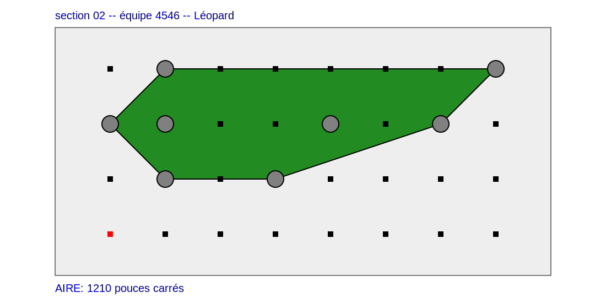

# Projet final - INF1900 - Projet initial de système embarqué

Projet final de première année en génie informatique et génie logiciel
à Polytechnique Montréal.

Présenté, le jeudi 20 avril 2023, à

- Jérôme Collin, ing. M. Sc. A., professeur
- Ghali Chraibi, chargé de laboratoire
- Paul Petitbon, chargé de laboratoire

## Auteurs

Équipe 4546

- Catalina Andrea Araya Figueroa
- Mehdi Benouhoud
- Laurent Bourgon
- Ihsane Majdoubi

## Fonctionnement

### Intégration

Au lancement du programme, le programme attend la sélection du mode
par les deux boutons.

- Le bouton *interrupt* sur la carte mère lance le mode [détection](#détection).
- Le bouton blanc sur le *breadboard* lance le mode [transmission](#transmission).
- Les deux boutons lance le mode [transmission en démonstration](#mode-démonstration).

### Détection

Au lancement du programme, la DEL sur la carte mère est ambrée.
Appuyer sur l'un des deux boutons sélectionne l'orientation de départ:

- Le bouton *interrupt* lorsque le robot pointe vers le haut
- Le bouton blanc lorsque le robot pointe vers la droite

Ensuite, le robot cherche le poteau.

La recherche de poteau se fait en tournant sur place
dans le sens horaire.
Une minuterie est utilisée pour connaître en tout
temps le quadrant vers lequel il pointe.

De plus, les positions inaccessibles sont éliminées.
Par exemple, s'il est au coin gauche de la table,
le robot ne vérifie que de nord à est.

Lorsque le robot trouve le poteau, il avance vers celui-ci.
Dès qu'il le perd, le robot se remet à chercher le poteau.
Une fois qu'il arrive à environ 15 cm du poteau, il s'arrête
et émet trois sons aigus et trois pauses de 300 ms.
S'il est trop proche du poteau, le robot recule.

Puis, le robot clignote ambré à 2 Hz et attend un appui sur
le bouton *interrupt*.

Si aucun poteau n'est détecté, le robot arrête de bouger,
émet un son grave pendant 2 secondes et clignote sa DEL rouge à 2 Hz.

### Transmission

Au lancement du programme, la DEL sur la carte mère est verte pendant 2 secondes.
Puis, durant toute la transmission, elle clignote verte à 10 Hz.
Une fois la transmission terminée, elle s'éteint.

Le programme récupère l'emplacement des poteaux dans sa mémoire.
Puis, il calcule l'[enveloppe convexe](https://fr.wikipedia.org/wiki/Enveloppe_convexe)
formée par les poteaux. Pour cela, il utilise le [parcours de Graham](https://fr.wikipedia.org/wiki/Parcours_de_Graham).
De cette enveloppe, il calcule l'aire du polygone par l'[algorithme de Gauss (en)](https://en.wikipedia.org/wiki/Shoelace_formula).

Ensuite, le fichier `.svg` est envoyé à l'ordinateur par RS232.
De plus, il calcule la somme de vérification CRC32 à l'ordinateur.
De cette manière, on s'assure que la transmission s'est déroulée comme prévue.

Quoique le script de réception Python s'occupera de la gestion du format,
voici le format de transmission:

```txt
╔════════════════════════════════════╗
║            START OF TEXT           ║
║                0x02                ║
╠════════════════════════════════════╣
║                 SVG                ║
╠════════════════════════════════════╣
║             END OF TEXT            ║
║                0x03                ║
╠════════════════════════════════════╣
║                CRC32               ║
║ 8 lowercase hexadecimal characters ║
║       polynomial: 0xEDB88320       ║
╠════════════════════════════════════╣
║         END OF TRANSMISSION        ║
║                0x04                ║
╚════════════════════════════════════╝
```

#### Mode démonstration

Ce mode est une variante du mode transmission.
Cependant, au lieu de lire la mémoire, le programme
va charger des points pré-configurés.
Cela est utile si jamais la [détection](#détection) fonctionne incorrectement.

Voici le résultat attendu du mode démonstration:


## Configuration électronique

| `io::Port` | `io::Position` | Composant                                    |
| ---------- | -------------- | -------------------------------------------- |
| `A`        | `PA0`          | [Capteur Infrarouge](lib/irSensor.hpp)       |
| `B`        | `PB0`          | [DEL (+)](lib/led.hpp)                       |
|            | `PB1`          | [DEL (-)](lib/led.hpp)                       |
|            | `PB2`          | [Sonnette (-)](lib/sound.hpp)                |
|            | `PB3`          | [Sonnette (+)](lib/sound.hpp)                |
| `C`        | `PC2`          | [Bouton blanc](lib/button.hpp)               |
| `D`        | `PD2`          | [Bouton interrupt](lib/button.hpp)           |
|            | `PD4`          | [Roues – Gauche – Direction](lib/wheels.hpp) |
|            | `PD5`          | [Roues – Droite – Direction](lib/wheels.hpp) |
|            | `PD6`          | [Roues – Gauche – Enable](lib/wheels.hpp)    |
|            | `PD7`          | [Roues – Droite – Enable](lib/wheels.cpp)    |

## Dépendances logicielles

### `serieViaUSB`

[`serieViaUSB`](https://cours.polymtl.ca/inf1900/fichiers/fichiers/serieViaUSB.tgz),
programme développé par Matthew Khouzam, Jérôme Collin, Michaël Ferris
et Mathieu Marengère-Gosselin, doit être installé afin de permettre
à l'ordinateur de recevoir les données transmises par le robot
lors de la tranmission du fichier `.svg`, ainsi que
lors d'un [débogage](#débogage) évantuel du robot.

Il doit être placé dans `$PATH`.

## Utilisation

### Installation du programme sur le robot

Pour installer le programme sur la carte, il faut s'assurer que la
librairie est compilée, puis ensuite, faire `make install`.
Il suffit d'exécuter la commande suivante dans le répertoire `projet` sur un terminal:

```bash
(cd lib && make) && (cd app && make install)
```

### Réception du fichier `.svg`

Afin de recevoir le fichier `.svg` de l'image représentant le plan de la table
avec les poteaux et le polygone, il faut les recevoirs à l'aide du script Python
fourni dans l'énoncé. On passe en argument le numéro d'équipe :

```bash
python3 reception_svg.py 4546
```

### Nettoyage des artéfacts de compilation

Dans le cas de la librairie (`lib`), comme dans le cas du
projet (`app`), il est possible de retirer les artéfacts de
compilation (fichiers `.o`, `.d`, `.elf`, `.hex`). Il suffit
de lancer la commande suivante :

```bash
(cd lib && make clean) && (cd app && make clean)
```

### Débogage

Il est possible de déboguer le programme afin que les instructions de débogage
soit prisent en compte par le compilateur. Ces instructions enverront des données
par protocole RS232.

```cpp
debug::send("Bonjour depuis le mode debug");
debug::send("Valeur", maVariable);
debug::send(maVariable);
```

#### Compilation en mode débogage

Pour lancer le mode *debug*, il faut compiler la librairie et
le programme d'exécution avec l'option `debug`.
De plus, il faut lancer `serieViaUSB` en mode lecture.
On exécute la commande suivante dans le répertoire `projet`.

```bash
(cd lib && make debug) && (cd app && make debug) && serieViaUSB -l
```

Il est à noter que serieViaUSB peut parfois malfonctionner sans explications.
Il faudra alors simplement relancer la commande.
De plus, il ne peut pas y avoir plusieurs instances de `serieViaUSB` en même temps.
Cela inclut aussi le script Python de réception.
